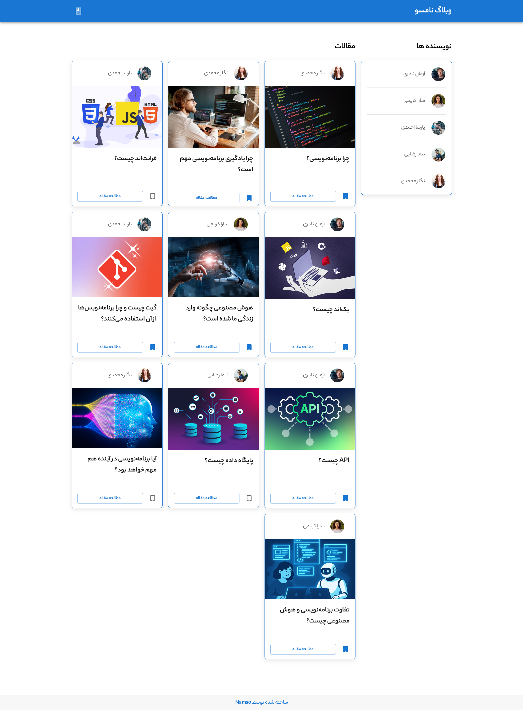
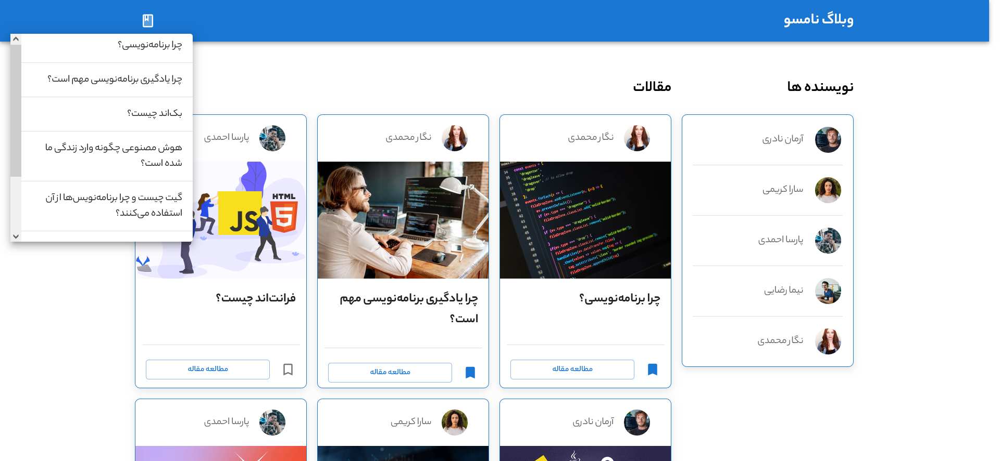
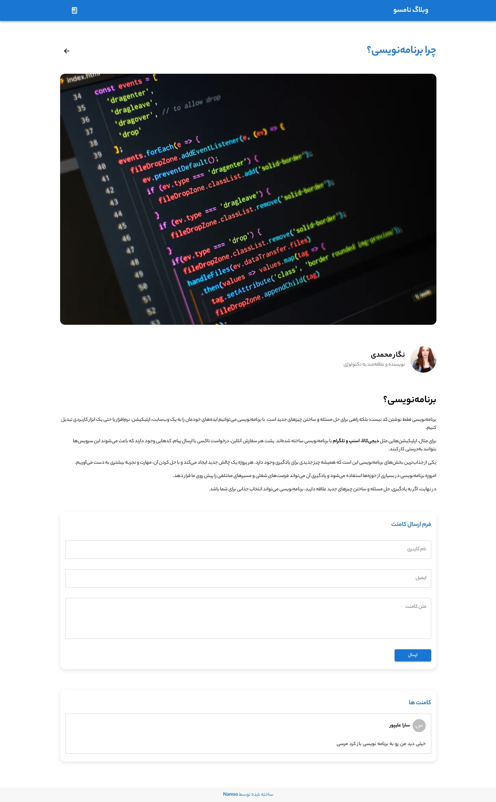
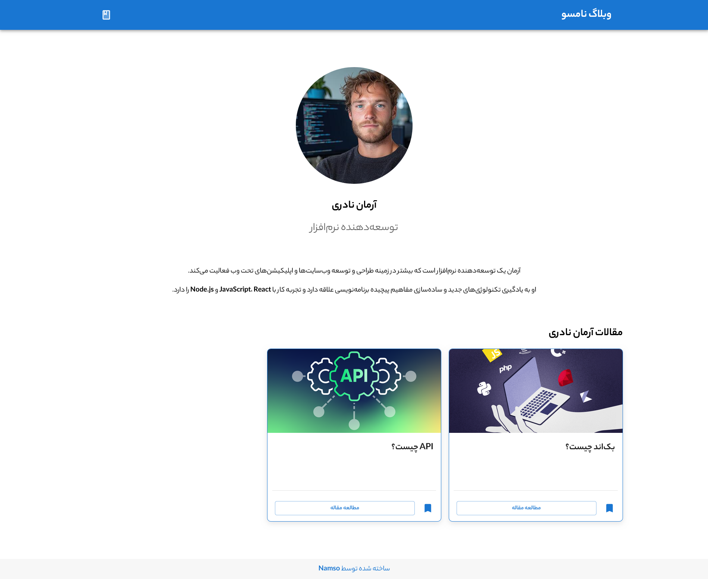
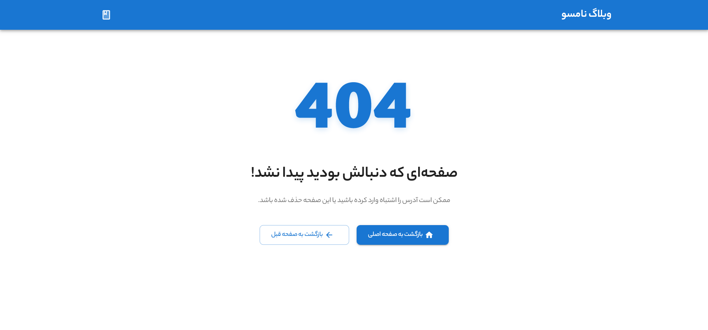
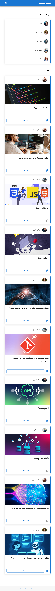

# 📝 Namso Blog (وبلاگ نامسو)

A modern, RTL (right-to-left) Persian blogging platform built with **React**, **Apollo Client**, **GraphQL (Hygraph)**, and **Material UI**. It allows readers to browse articles, explore authors, bookmark posts, and leave comments.

---

## ✨ Features

- **Home Page** — Displays the latest blog posts in a responsive grid.
- **Blog Post Page** — Full article view with cover image, author info, and rich HTML content (sanitized).
- **Author Page** — Author profile with avatar, bio, field of expertise, and their published articles.
- **Authors List** — Sidebar/list of all authors with hover effects and links to profiles.
- **Bookmarks** — Toggle bookmarks on posts with optimistic UI updates and a header dropdown showing all bookmarked posts.
- **Comments** — Users can leave comments on posts (with validation and toast notifications). Comments are displayed below each article.
- **Custom Persian Font** — YekanBakh font family integrated with multiple weights (300–900).
- **Responsive Design** — Fully responsive across mobile, tablet, and desktop using MUI Grid.
- **RTL Support** — Built for Persian/Farsi content.
- **Sanitized HTML** — Article and author descriptions are sanitized with `sanitize-html` before rendering.

---

## 🛠️ Tech Stack

| Category      | Technology                                     |
| ------------- | ---------------------------------------------- |
| Frontend      | React (Vite)                                   |
| Routing       | React Router DOM                               |
| Data Layer    | Apollo Client + GraphQL                        |
| Backend / CMS | Hygraph (GraphQL endpoint via `VITE_ENDPOINT`) |
| UI Library    | Material UI (MUI)                              |
| Notifications | React Toastify                                 |
| Loaders       | React Loader Spinner                           |
| Sanitization  | sanitize-html                                  |

---

## 🗺️ Routes

| Path             | Component    | Description                                    |
| ---------------- | ------------ | ---------------------------------------------- |
| `/`              | `HomePage`   | Landing page with all posts                    |
| `/blogs/:slug`   | `BlogPage`   | Single blog post by slug                       |
| `/authors/:slug` | `AuthorPage` | Single author profile by slug                  |
| `*`              | `NotFound`   | 404 page for unknown paths and missing content |

> **Note:** `BlogPage` and `AuthorPage` also render `<NotFound />` when the requested post or author does not exist in the backend.

---

## 🔌 GraphQL API

### Queries

| Query               | Description                                       |
| ------------------- | ------------------------------------------------- |
| `GET_BLOGS_INFO`    | Fetch all posts with author + cover photo         |
| `GET_AUTHORS_INFO`  | Fetch all authors with avatars                    |
| `GET_AUTHOR_INFO`   | Fetch a single author by slug with their posts    |
| `GET_POST_INFO`     | Fetch a single post by slug with author + content |
| `GET_POST_COMMENTS` | Fetch all comments for a post by slug             |

### Mutations

| Mutation               | Description                                    |
| ---------------------- | ---------------------------------------------- |
| `SEND_COMMENT`         | Create a new comment linked to a post via slug |
| `TOGGLE_POST_BOOKMARK` | Update `isBookmarked` and publish the post     |

**Bookmarking** uses Apollo's **optimistic response** + `cache.modify` so the UI updates instantly across all components that reference the post.

---

## 🎨 Theming & Fonts

- **MUI Theme** — Customized via `src/mui/theme.js`.
- **Persian Font** — `YekanBakh` loaded from local `.woff`, `.ttf`, and `.eot` files with weights: **300, 400, 500, 700, 800, 900**.
- **Primary Color** — `#1976D2` (used for borders, links, buttons).

---

## ✅ Validation Rules

Comments are validated client-side before submission:

| Field | Rule                             |
| ----- | -------------------------------- |
| Name  | Required, min **3** characters   |
| Email | Required, must match email regex |
| Text  | Required, min **10** characters  |

Invalid submissions trigger a **toast warning** instead of sending the mutation.

---

## 📸 Screenshots

---

## 🧰 Built With

- [Material UI](https://mui.com/) — for the component library
- [Apollo Client](https://www.apollographql.com/) — for GraphQL state management
- [Hygraph](https://hygraph.com/) — headless CMS backend
- [React Toastify](https://fkhadra.github.io/react-toastify/) — for notifications
- **YekanBakh** font — for beautiful Persian typography
